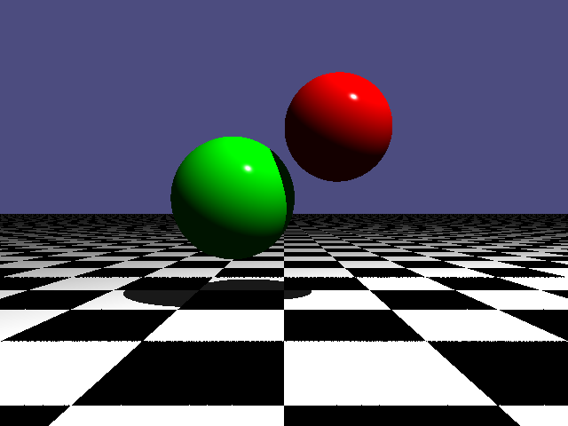

# C++ Ray Tracer

This is a Ray Tracer I made for CSCI312 in Fall 2024.\
It takes a file called **"scene1.txt"** and outputs an image file called **"img.ppm"**. \
It has implementations for: Spheres, Planes, and Scene Lighting\
\
This was a fun introduction to C++ for me. Before this, I only knew the basics, and I learned invaluable skills in one of the most important languages there is. I already had a lot of C experience, so I translated my C Ray Tracer to C++ which also made it object oriented. I learned a lot about computer graphics and the math behind it, memory management, software design, and implementing new file types, including a custom file format.\
Also check out my [C Ray Tracer](https://github.com/skbennett/C-Ray-Tracer) (It uses the same input files).

## Compilation and Running

```bash
git clone https://github.com/skbennett/CPP-Ray-Tracer.git
cd CPP-Ray-tracer
g++ *.cpp -o rt
./rt
```

Each time **./rt** is ran, a new **img.ppm** is created in the same directory. \
PPM Files can be viewed **[here](https://jumpshare.com/viewer/ppm)**

## Example

The provided **scene1.txt** is a sample with a red sphere and a green sphere over a checkerboarded floor\


## Making your own Scene

### The scene files are formatted like this:

**The "camera" in the scene is located at 0,0,0, so all locations are relative to that.**\
**Comments** can be made in **capital letters** because the program does not recognize them.

### Spheres

- **s** declares that you are making a sphere. This must be lowercase.
- **X, Y, Z** are the coordinates where the center of the sphere will be. These are decimal values.
- **r** is the radius of the sphere.
- **R, G, B** are the RGB color values for the sphere. These are decimal values up to 1.

```
s
X Y Z
r
R G B
```

### Planes

The planes are infinite, so they only stop where they intersect another plane.\
The planes are checkerboarded by default, so if different values are given for both sets of RGB, then the plane will have a checkerboard

- **p** declares that you are making a plane. This must be lowercase.
- **X, Y, Z** Normal vector componenets for the Plane.
- **D** Scalar constant that shifts the plane along the normal from the origin
- **r, g, b** First set of RGB values for plane.
- **R, G, B** Second set of RGB values for plane. If you do not want a checkerboard, set and the same values as the first set

```
p
X Y Z
D
r g b
R G B
```

### Light

Sets the Location for the lighting in the scene

- **l** Declares that you are making light. Must be lowercase.
- **X, Y, Z** Location of light in the scene.

```
l
X Y Z
```
